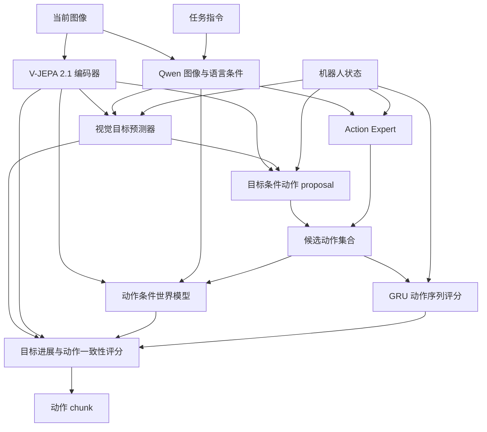

# JEPA Learned Goal

基于潜在视觉目标的视觉语言动作框架。模型从当前图像、任务指令和机器人状态预测未来目标，在 JEPA 特征空间评估候选动作的执行结果，输出动作 chunk。

## 方法



**目标预测。** 冻结的 V-JEPA 2.1 提取当前视觉特征，与 Qwen 的图像／指令条件特征及 state 一起输入 MLP，输出未来视觉目标 latent。训练目标从示范未来帧自动构造；部署时由当前输入直接预测。

**动作生成。** 目标条件 proposal 根据当前视觉特征、预测目标和 state 生成一个候选，Action Expert 生成其余候选，默认共 8 个。

**动作验证。** 世界模型预测各个候选对应的未来视觉特征，以接近预测目标的程度衡量任务进展。GRU 根据当前 state 和前序动作预测下一步动作，其误差作为动作序列一致性评分。两项合并后选出动作 chunk。

目标、动作监督和世界模型预测使用相同时间跨度。当前帧与未来目标帧独立编码，目标条件动作训练同时使用真实目标与预测目标。默认视觉特征为 1024 维；state、action 维度与 chunk 长度由控制接口配置决定。

训练包含动作学习、未来特征预测、位移预测、逆动力学、动作先验、目标条件动作重建和目标预测七项损失。其中逆动力学辅助头从视觉 latent 差值与 state 重建单步动作；部署时由目标条件 proposal 和 Action Expert 生成完整 chunk。网络结构与损失配置见 [方法说明](docs/learned_goals.md)。

## 环境与安装

以下流程面向 Linux 单机 8×A100，使用 Python 3.10、PyTorch 2.6.0、BF16 和 DeepSpeed ZeRO-2。安装 FlashAttention 需要 CUDA toolkit 与 `nvcc`；可使用 CUDA 12.4，并配置相应 NVIDIA 驱动。

```bash
git clone --branch feat/jepa-learned-goal https://github.com/Ju6276/VLA-JEPA-DEV.git
cd VLA-JEPA-DEV
conda create -n VLA_JEPA python=3.10 -y
conda activate VLA_JEPA

python -m pip install --upgrade pip wheel packaging ninja psutil
python -m pip install torch==2.6.0 torchvision==0.21.0 \
  --index-url https://download.pytorch.org/whl/cu124
python -m pip install -r requirements.txt
MAX_JOBS=4 python -m pip install flash-attn==2.7.4.post1 --no-build-isolation
python -m pip install -e .
```

## 预训练模型

下载 [Qwen3-VL-2B-Instruct](https://huggingface.co/Qwen/Qwen3-VL-2B-Instruct) 与 [V-JEPA 2.1 ViT-L 384px](https://github.com/facebookresearch/vjepa2#v-jepa-21-pretrained-checkpoints)，供各训练进程读取同一份本地权重。

```bash
export MODEL_ROOT=/path/to/models
mkdir -p "${MODEL_ROOT}"

hf download Qwen/Qwen3-VL-2B-Instruct \
  --local-dir "${MODEL_ROOT}/Qwen3-VL-2B-Instruct"
wget -c https://dl.fbaipublicfiles.com/vjepa2/vjepa2_1_vitl_dist_vitG_384.pt \
  -O "${MODEL_ROOT}/vjepa2_1_vitl_dist_vitG_384.pt"

export QWEN_MODEL="${MODEL_ROOT}/Qwen3-VL-2B-Instruct"
export VJEPA21_CKPT="${MODEL_ROOT}/vjepa2_1_vitl_dist_vitG_384.pt"
```

`QWEN_MODEL` 指向模型目录，`VJEPA21_CKPT` 指向 `.pt` 文件。下文命令中的 `/path/to/...` 均替换为本机实际路径。

## 数据与控制接口

数据使用 LeRobot v2.1 格式。每个训练样本包含当前观测、任务指令、state、动作 chunk 及对应的未来图像。未来图像由数据加载器按时间偏移读取，用于构造目标 latent 监督，无需预先提取 subgoal 文件。

| 配置 | SIMPLE | SONIC |
|---|---|---|
| 观测 | 单 ego RGB + 指令 | 单 ego RGB + 指令 |
| state | 32 维 | 46 维 |
| 每步 action | 36 维关节目标与运动控制 | 64 维 motion token + 14 维双手控制 |
| chunk 长度 | 30 | 40 |
| 未来目标时刻 | t+30 | t+40 |

**SIMPLE 仿真数据。** 从 [USC-PSI-Lab/psi-data](https://huggingface.co/datasets/USC-PSI-Lab/psi-data) 下载并解压：

```bash
export SIMPLE_DATA_ROOT=/path/to/simple_data
export DOWNLOAD_ROOT=/path/to/downloads
hf download USC-PSI-Lab/psi-data \
  simple/G1WholebodyLocomotionPickBetweenTablesTeleop-v0.zip \
  --repo-type dataset --local-dir "${DOWNLOAD_ROOT}"
mkdir -p "${SIMPLE_DATA_ROOT}/dataset"
unzip "${DOWNLOAD_ROOT}/simple/G1WholebodyLocomotionPickBetweenTablesTeleop-v0.zip" \
  -d "${SIMPLE_DATA_ROOT}/dataset"
```

**SONIC 数据。** 使用 [SonicStar 提供的数据集](https://github.com/BlackOtters/SonicStar#采集数据)：

```bash
export SONIC_DATA_ROOT=/path/to/sonic_data
hf download Tang-keke/merged_dataset_001 --repo-type dataset \
  --local-dir "${SONIC_DATA_ROOT}/merged_dataset_001"
```

数据目录与训练配置中的 dataset 名称对应：

```text
${SIMPLE_DATA_ROOT}/dataset/G1WholebodyLocomotionPickBetweenTablesTeleop-v0/
${SONIC_DATA_ROOT}/merged_dataset_001/
```

每个数据集目录下应包含以下内容：

```text
data/chunk-000/episode_000000.parquet
videos/chunk-000/<camera-key>/episode_000000.mp4
meta/info.json
meta/modality.json
meta/episodes.jsonl
meta/tasks.jsonl
```

SIMPLE 的相机字段为 `egocentric`，SONIC 为 `observation.images.ego_view`。两套接口分别训练，使用各自的数据统计与 checkpoint。SONIC 的 64 维 motion token 是控制器动作编码，与 V-JEPA 的视觉 latent 属于不同空间。字段顺序、state 处理和动作反归一化见 [控制接口](docs/control_interfaces.md)。

## 单机 8×A100 训练

在已激活的环境中设置公共参数：

```bash
export CUDA_VISIBLE_DEVICES=0,1,2,3,4,5,6,7
export NUM_PROCESSES=8
export OUTPUT_ROOT=/path/to/checkpoints
export WANDB_MODE=offline
export NUM_WORKERS=4
export OMP_NUM_THREADS=4
export FFMPEG_THREADS=1
```

以下启动示例采用每卡 batch 为 1，通过梯度累积设置有效 batch。有效 batch = GPU 数 × 每卡 batch × 累积步数；可根据显存提高每卡 batch，并同比降低累积步数。`NUM_WORKERS` 是每个训练进程的数据加载进程数，可按 CPU 和存储带宽调整。

| 启动示例 | GPU 数 | 每卡 batch | 累积步数 | 有效 batch |
|---|---:|---:|---:|---:|
| SIMPLE | 8 | 1 | 32 | 256 |
| SONIC | 8 | 1 | 4 | 32 |

**训练 SIMPLE。** 使用 [SIMPLE 配置](scripts/config/vlajepa_g1_pick_between_tables_vjepa21_8xa100.yaml)：

```bash
DATA_ROOT="${SIMPLE_DATA_ROOT}" \
RUN_ID=simple_learned_goal_8xa100 \
PER_DEVICE_BATCH_SIZE=1 \
  bash scripts/train_g1_delta_jepa_8xa100.sh \
    --trainer.gradient_accumulation_steps 32 \
    --trainer.max_train_steps 40000 \
    --trainer.save_interval 10000
```

**训练 SONIC。** 使用 [SONIC 配置](scripts/config/vlajepa_sonic_latent_learned_goal.yaml)：

```bash
DATA_ROOT="${SONIC_DATA_ROOT}" \
RUN_ID=sonic_learned_goal_8xa100 \
PER_DEVICE_BATCH_SIZE=1 \
  bash scripts/train_sonic_learned_goal.sh \
    --trainer.gradient_accumulation_steps 4 \
    --trainer.max_train_steps 40000 \
    --trainer.save_interval 10000
```

两个命令分别占用整机 8 张卡，按所需控制接口选择运行。训练步数按优化器更新计数；默认 warmup 为 2,000 次更新，日志间隔为 10 次更新，动作预测诊断间隔为 500 次更新。默认 seed 为 42，Qwen 与动作模块的学习率分别为 `1e-5`、`1e-4`，V-JEPA 编码器保持冻结。

GPU 数通过 `NUM_PROCESSES` 设置；脚本末尾的 `--trainer.*`、`--datasets.*` 参数覆盖训练配置。采样默认保留示范尾段并补齐；可通过 `--datasets.vla_data.require_full_horizon true` 仅采样动作和未来目标都完整的片段。更多配置见 [训练说明](docs/learned_goals.md)。

## 输出与续训

每次训练保存到 `${OUTPUT_ROOT}/${RUN_ID}/`：

```text
<run>/
├── config.yaml
├── config.json
├── dataset_statistics.json
├── summary.jsonl
├── tensorboard/
├── wandb/
├── checkpoints/
│   ├── steps_10000/                  # 完整训练状态
│   ├── steps_10000_pytorch_model.pt  # 部署权重
│   └── ...
└── final_model/
    └── pytorch_model.pt
```

使用 TensorBoard 查看训练指标：

```bash
tensorboard --logdir "${OUTPUT_ROOT}" --port 6006
```

续训使用 `steps_N/` 完整状态目录，恢复模型、优化器、学习率调度、随机状态、训练步数与数据位置。沿用原训练的数据、每卡 batch、GPU 数、累积步数和训练配置，保持 Qwen 与 V-JEPA 权重路径可访问。以下为 SONIC 从第 10,000 次更新继续到第 40,000 次更新：

```bash
DATA_ROOT="${SONIC_DATA_ROOT}" \
RUN_ID=sonic_learned_goal_8xa100 \
PER_DEVICE_BATCH_SIZE=1 \
  bash scripts/train_sonic_learned_goal.sh \
    --trainer.gradient_accumulation_steps 4 \
    --trainer.max_train_steps 40000 \
    --trainer.save_interval 10000 \
    --trainer.resume_from_checkpoint \
    "${OUTPUT_ROOT}/sonic_learned_goal_8xa100/checkpoints/steps_10000"
```

SIMPLE 续训使用其对应脚本、数据路径、run 名称和累积步数 `32`。独立 `.pt` 文件用于部署或通过 `trainer.pretrained_checkpoint` 初始化模型权重；完整续训使用上述状态目录。

## 部署

```bash
CUDA_VISIBLE_DEVICES=0 python -m deployment.model_server.server_policy \
  --ckpt_path "${OUTPUT_ROOT}/sonic_learned_goal_8xa100/checkpoints/steps_40000_pytorch_model.pt" \
  --cuda 0 --use_bf16 --port 10093
```

客户端发送当前 ego RGB、任务指令和归一化 state。服务返回 `normalized_actions`，客户端按对应统计量反归一化后执行。

默认自动目标预测与 verifier 开启，`subgoals_path: null`，部署无需外部 subgoal 图片，响应中的 `goal_source` 为 `predicted`。服务加载一份 V-JEPA 编码器并复用其视觉特征。SIMPLE 使用对应 run 的 checkpoint，启动方式相同。

将模型复制到部署机器时，保留上述 run 目录结构中的 `config.yaml`、`dataset_statistics.json` 与所选 `.pt` 权重，并使配置中的 Qwen 与 V-JEPA 路径在部署机器上可访问。正常结束训练后，也可使用 `final_model/pytorch_model.pt` 部署。

请求字段、响应格式和客户端示例见 [部署协议](deployment/model_server/README.md)。

## 致谢

基于 [VLA-JEPA](https://github.com/ginwind/VLA-JEPA) 与 [starVLA](https://github.com/starVLA/starVLA)，使用 [Qwen3-VL](https://huggingface.co/Qwen/Qwen3-VL-2B-Instruct) 和 [V-JEPA](https://github.com/facebookresearch/vjepa2) 模型。
