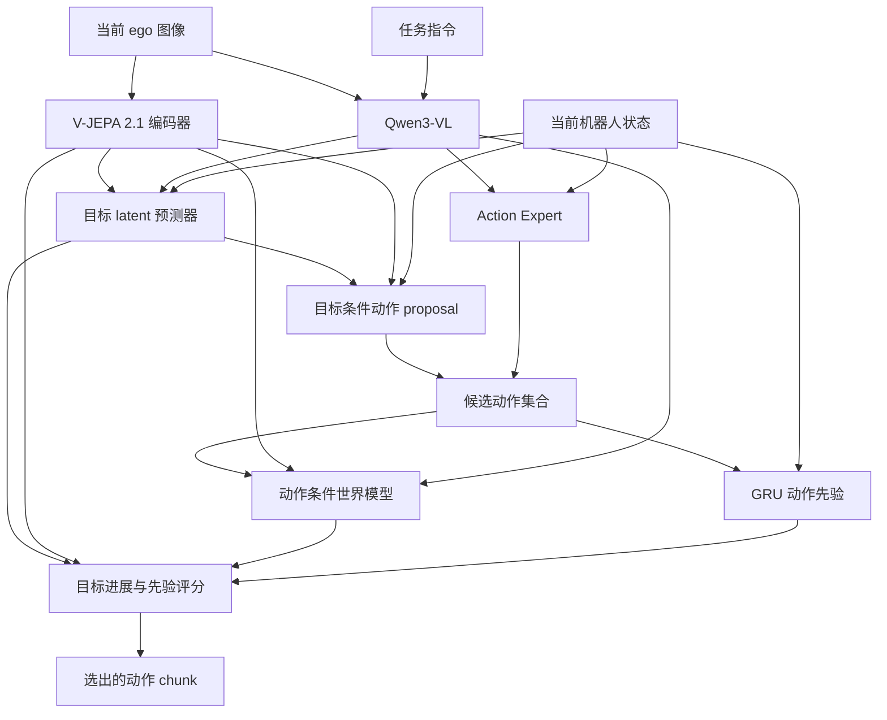

# G1 JEPA Learned Goal

面向 Unitree G1 的单视角视觉语言动作框架。模型结合 V-JEPA 2.1 视觉表征、指令条件目标预测、动作条件世界模型和 GRU 动作先验，从当前 ego 图像、任务指令与机器人状态生成动作 chunk。

支持两种控制接口：**SIMPLE 仿真：32 维 state / 36 维 action**；**SONIC 真机：46 维 state / 78 维 action**。

[方法](docs/learned_goals.md) · [控制接口](docs/control_interfaces.md) · [8×A100 训练](README_8XA100_中文.md) · [部署协议](deployment/model_server/README.md)

## 方法



1. **视觉目标预测**：将当前 JEPA 特征、Qwen 图像／指令条件特征和 state 输入 MLP，预测未来视觉目标 latent。训练监督来自示范的未来帧，部署时自动预测目标。
2. **动作候选生成**：目标条件 proposal 生成一个动作 chunk，Action Expert 通过采样生成其余候选，默认共 8 个。
3. **执行结果预测**：世界模型结合当前视觉特征、指令条件与候选动作，预测 chunk 末端的视觉特征。
4. **候选评分**：计算候选带来的视觉目标进展，并扣除 GRU 下一步动作预测误差，选取最高分候选。

JEPA 的视觉 latent 与 SONIC 的 motion token 分别承担目标表征和运动控制。默认视觉特征维度为 1024；SONIC 动作为 64 维 motion token 加 14 维双手控制。训练与推理的数据流、损失定义见 [方法说明](docs/learned_goals.md)。

## 安装

```bash
git clone --branch feat/g1-jepa-learned-goal https://github.com/Ju6276/VLA-JEPA-DEV.git
cd VLA-JEPA-DEV

conda create -n VLA_JEPA python=3.10 -y
conda activate VLA_JEPA
pip install -r requirements.txt
pip install flash-attn --no-build-isolation
pip install -e .
```

训练使用 CUDA、BF16 和 DeepSpeed ZeRO-2。依赖版本由 [requirements.txt](requirements.txt) 定义。

## 预训练模型

| 模型 | 用途 | 来源 |
|---|---|---|
| Qwen3-VL-2B-Instruct | 图像与语言条件特征 | [Hugging Face](https://huggingface.co/Qwen/Qwen3-VL-2B-Instruct) |
| V-JEPA 2.1 ViT-L 384px | 冻结的视觉编码器 | [Meta V-JEPA](https://github.com/facebookresearch/vjepa2) |

准备 `vjepa2_1_vitl_dist_vitG_384.pt`，设置模型与输出路径：

```bash
export VJEPA21_CKPT=/path/to/vjepa2_1_vitl_dist_vitG_384.pt
export QWEN_MODEL=Qwen/Qwen3-VL-2B-Instruct
export OUTPUT_ROOT=/path/to/checkpoints
export NUM_PROCESSES=8
export WANDB_MODE=offline
```

`QWEN_MODEL` 支持 Hugging Face 模型 ID 或本地模型目录。V-JEPA 2.1 通过仓库中的 [编码器适配器](starVLA/model/modules/world_model/vjepa21_encoder.py) 加载 `.pt` 权重。

## 数据准备

数据使用 LeRobot 格式，包含 `data/`、`videos/`、`meta/info.json` 和 `meta/modality.json`。训练从同一条示范读取当前观测、动作 chunk 和未来目标图像。

### SIMPLE

下载 [SIMPLE Pick Between Tables 数据](https://huggingface.co/datasets/USC-PSI-Lab/psi-data/tree/main/simple)：

```bash
export DATA_ROOT=/path/to/sim_data_root
hf download USC-PSI-Lab/psi-data \
  simple/G1WholebodyLocomotionPickBetweenTablesTeleop-v0.zip \
  --repo-type dataset --local-dir /path/to/downloads

mkdir -p "${DATA_ROOT}/dataset"
unzip /path/to/downloads/simple/G1WholebodyLocomotionPickBetweenTablesTeleop-v0.zip \
  -d "${DATA_ROOT}/dataset"
```

目录结构：

```text
sim_data_root/
└── dataset/G1WholebodyLocomotionPickBetweenTablesTeleop-v0/
    ├── data/
    ├── videos/
    └── meta/
```

### SONIC

使用 [SONIC latent 数据](https://huggingface.co/datasets/Tang-keke/merged_dataset_001) 或按相同字段组织的采集数据：

```text
sonic_data_root/
└── merged_dataset_001/
    ├── data/
    ├── videos/
    └── meta/
```

视频键、关节顺序、motion token 与归一化方式见 [控制接口](docs/control_interfaces.md)。自定义数据集通过 [mixtures.py](starVLA/dataloader/gr00t_lerobot/mixtures.py) 注册，并在 [data_config.py](starVLA/dataloader/gr00t_lerobot/data_config.py) 中定义字段和变换。

## 训练

| 配置 | SIMPLE | SONIC |
|---|---|---|
| state / action | 32 / 36 | 46 / 78 |
| chunk 长度 | 30 | 40 |
| 目标时刻 | t+30 | t+40 |
| 每卡默认 batch | 32 | 4 |
| 默认 run_id | `g1_pick_between_tables_delta_jepa_8xa100` | `sonic_latent_learned_goal` |
| 配置文件 | [SIMPLE YAML](scripts/config/vlajepa_g1_pick_between_tables_vjepa21_8xa100.yaml) | [SONIC YAML](scripts/config/vlajepa_sonic_latent_learned_goal.yaml) |

SIMPLE：

```bash
DATA_ROOT=/path/to/sim_data_root bash scripts/train_g1_delta_jepa_8xa100.sh
```

SONIC：

```bash
DATA_ROOT=/path/to/sonic_data_root bash scripts/train_sonic_learned_goal.sh
```

调整 GPU 数量、batch 或训练步数：

```bash
NUM_PROCESSES=4 PER_DEVICE_BATCH_SIZE=2 \
DATA_ROOT=/path/to/sonic_data_root \
  bash scripts/train_sonic_learned_goal.sh \
    --trainer.max_train_steps 40000 \
    --trainer.save_interval 5000
```

每个 run 独立保存配置、数据归一化统计、训练日志和 checkpoint。SIMPLE 与 SONIC 分别训练各自的状态输入层和控制模块。完整训练步骤见 [8×A100 指南](README_8XA100_中文.md)。

## 部署

加载训练得到的 checkpoint，启动 WebSocket 服务：

```bash
python -m deployment.model_server.server_policy \
  --ckpt_path /path/to/checkpoints/sonic_latent_learned_goal/checkpoints/steps_40000_pytorch_model.pt \
  --cuda 0 --use_bf16 --port 10093
```

客户端发送当前 ego RGB、任务指令和归一化后的 state。服务返回动作 chunk，客户端按对应统计量反归一化，再交给 SIMPLE 或 SONIC 控制接口执行。

默认 `learned_goal_enabled: true`、`use_verifier: true`、`subgoals_path: null`。目标预测器在每次请求中计算目标，返回的 `goal_source` 为 `predicted`。服务同时加载 V-JEPA 编码器与世界模型；checkpoint 配置中的基础模型路径应在部署机器上可访问。

客户端示例、请求与响应字段见 [部署文档](deployment/model_server/README.md)。

## 配置与实验

| 参数 | 默认值 | 含义 |
|---|---|---|
| `learned_goal_enabled` | `true` | 自动预测视觉目标 |
| `goal_proposal_predicted_weight` | `0.5` | proposal 训练中预测目标条件的占比 |
| `goal_action_proposal_enabled` | `true` | 使用目标条件动作候选 |
| `verifier_num_candidates` | `8` | 候选动作数量 |
| `verifier_action_prior_weight` | `0.1` | GRU 预测误差的评分权重 |
| `use_verifier` | `true` | 执行动作候选评分 |

这些参数位于 YAML 的 `framework.delta_jepa` 节点。运行时控制、实验对照及 checkpoint 初始化见 [方法说明](docs/learned_goals.md#实验配置)。

## 测试

```bash
pip install pytest
OMP_NUM_THREADS=1 NO_ALBUMENTATIONS_UPDATE=1 \
  python -m pytest tests/test_learned_goal.py -q
```

测试使用轻量骨干，覆盖训练梯度、未来信息隔离、自动目标推理、显式目标覆盖、BF16 输出、权重恢复，以及 SIMPLE / SONIC 的接口与时间对齐。

## 代码结构

```text
starVLA/model/framework/VLA_JEPA.py              训练与候选验证流程
starVLA/model/modules/world_model/delta_jepa.py   目标预测、动作 proposal、GRU prior
starVLA/model/modules/world_model/vjepa21_encoder.py
                                                V-JEPA 2.1 编码器适配
starVLA/dataloader/                              数据读取、字段映射与归一化
scripts/config/                                 模型与训练配置
scripts/train_learned_goal.sh                    通用训练启动器
deployment/model_server/                        WebSocket 推理服务与客户端
tests/test_learned_goal.py                      集成测试
```

## 致谢

本项目基于 [VLA-JEPA](https://github.com/ginwind/VLA-JEPA) 和 [starVLA](https://github.com/starVLA/starVLA)，使用 [Qwen3-VL](https://github.com/QwenLM/Qwen3-VL) 与 [V-JEPA](https://github.com/facebookresearch/vjepa2) 模型，并对接 [SIMPLE](https://github.com/physical-superintelligence-lab/SIMPLE) 与 SONIC 控制接口。
