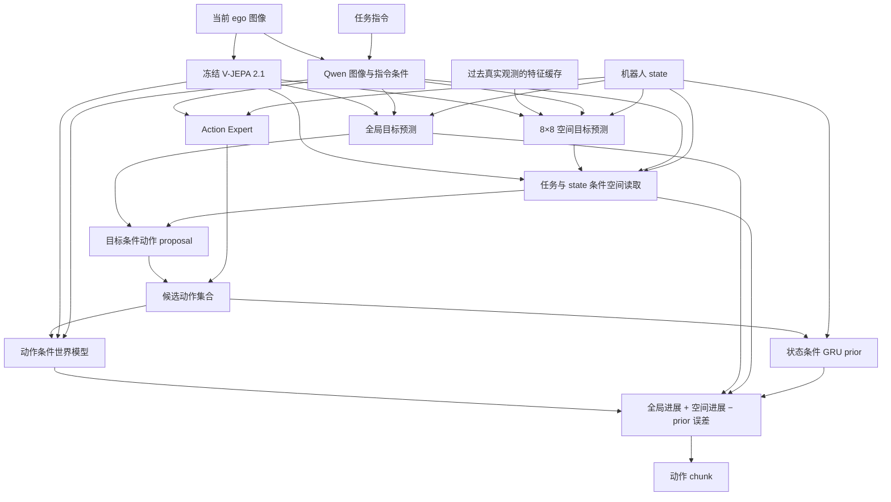

# JEPA Spatial Goal

面向单目 ego 视觉移动操作的视觉语言动作框架。模型从当前观测、指令、机器人状态与真实观测历史预测全局及空间 subgoal latent，解码动作 chunk，并根据候选动作的未来视觉进展与序列一致性选择动作。

## 方法



**空间目标。** 当前 JEPA patch 特征固定汇聚为 8×8 网格，空间预测器结合指令、state 与过去观测，预测同一时间跨度的未来网格。全局目标预测器同时输出整体视觉目标。未来示范帧通过冻结编码器自动生成监督，直接使用已有 RGB、指令、state 与 action，无需框、mask、物体 ID 或预先提取的 subgoal 文件。

**目标条件动作。** 任务与 state 生成 4 个空间查询，从当前和目标网格读取局部特征。局部动作适配器输出完整 chunk 的残差，与全局目标条件 proposal 相加；Action Expert 生成其余候选，默认共 8 个。空间读取器通过动作重建损失与策略模块一起训练。

**未来评分。** 世界模型用候选动作预测未来 patch 特征。所有候选共享当前任务查询和预测目标，综合全局进展、局部空间进展与 GRU 动作 prior 误差，选择得分最高的动作。

**真实历史。** 默认读取当前时间前 0.8、0.4 秒的观测，使用实际间隔和有效性 mask。训练从同一 episode 视频读取，每个有效历史以 0.25 的概率随机屏蔽，覆盖历史缺失条件；部署缓存已经看到的特征。当前、过去、未来图像分别独立编码。历史用于空间目标预测，想象的候选未来不进入缓存。

主配置保持五类训练损失，目标预测项包含全局 cosine 与空间 L1 两个独立记录的分量；`delta_loss` 和 `ctrl_loss` 默认权重为零。公式、模块结构和消融方式见 [方法与训练说明](docs/spatial_goals.md)。

## 环境与安装

以下流程面向 Linux 单机 8×A100，使用 Python 3.10、PyTorch 2.6.0、BF16 和 DeepSpeed ZeRO-2。安装 FlashAttention 需要 CUDA toolkit 与 `nvcc`；可使用 CUDA 12.4，并配置相应 NVIDIA 驱动。

```bash
git clone --branch feat/jepa-spatial-goal https://github.com/Ju6276/VLA-JEPA-DEV.git
cd VLA-JEPA-DEV
conda create -n VLA_JEPA python=3.10 -y
conda activate VLA_JEPA

python -m pip install --upgrade pip wheel packaging ninja psutil
python -m pip install torch==2.6.0 torchvision==0.21.0 \
  --index-url https://download.pytorch.org/whl/cu124
python -m pip install -r requirements.txt
MAX_JOBS=4 python -m pip install flash-attn==2.7.4.post1 --no-build-isolation
python -m pip install -e .
```

## 预训练模型

下载 [Qwen3-VL-2B-Instruct](https://huggingface.co/Qwen/Qwen3-VL-2B-Instruct) 与 [V-JEPA 2.1 ViT-L 384px](https://github.com/facebookresearch/vjepa2#v-jepa-21-pretrained-checkpoints)，供各训练进程读取同一份本地权重。

```bash
export MODEL_ROOT=/path/to/models
mkdir -p "${MODEL_ROOT}"

hf download Qwen/Qwen3-VL-2B-Instruct \
  --local-dir "${MODEL_ROOT}/Qwen3-VL-2B-Instruct"
wget -c https://dl.fbaipublicfiles.com/vjepa2/vjepa2_1_vitl_dist_vitG_384.pt \
  -O "${MODEL_ROOT}/vjepa2_1_vitl_dist_vitG_384.pt"

export QWEN_MODEL="${MODEL_ROOT}/Qwen3-VL-2B-Instruct"
export VJEPA21_CKPT="${MODEL_ROOT}/vjepa2_1_vitl_dist_vitG_384.pt"
```

`QWEN_MODEL` 指向模型目录，`VJEPA21_CKPT` 指向 `.pt` 文件。下文命令中的 `/path/to/...` 均替换为本机实际路径。

## 数据与控制接口

数据使用 LeRobot v2.1 格式。每个训练样本包含当前观测、任务指令、state、动作 chunk 及对应的未来图像。未来图像由数据加载器按时间偏移读取，用于构造目标 latent 监督；过去图像按 episode 内的时间戳读取。使用原有示范即可训练，无需新增区域标注或离线定位阶段。

| 配置 | SIMPLE | SONIC |
|---|---|---|
| 观测 | 单 ego RGB + 指令 | 单 ego RGB + 指令 |
| state | 32 维 | 46 维 |
| 每步 action | 36 维关节目标与运动控制 | 64 维 motion token + 14 维双手控制 |
| chunk 长度 | 30 | 40 |
| 未来目标时刻 | t+30 | t+40 |

**SIMPLE 仿真数据。** 从 [USC-PSI-Lab/psi-data](https://huggingface.co/datasets/USC-PSI-Lab/psi-data) 下载并解压：

```bash
export SIMPLE_DATA_ROOT=/path/to/simple_data
export DOWNLOAD_ROOT=/path/to/downloads
hf download USC-PSI-Lab/psi-data \
  simple/G1WholebodyLocomotionPickBetweenTablesTeleop-v0.zip \
  --repo-type dataset --local-dir "${DOWNLOAD_ROOT}"
mkdir -p "${SIMPLE_DATA_ROOT}/dataset"
unzip "${DOWNLOAD_ROOT}/simple/G1WholebodyLocomotionPickBetweenTablesTeleop-v0.zip" \
  -d "${SIMPLE_DATA_ROOT}/dataset"
```

**SONIC 数据。** 使用 [SonicStar 提供的数据集](https://github.com/BlackOtters/SonicStar#采集数据)：

```bash
export SONIC_DATA_ROOT=/path/to/sonic_data
hf download Tang-keke/merged_dataset_001 --repo-type dataset \
  --local-dir "${SONIC_DATA_ROOT}/merged_dataset_001"
```

数据目录与训练配置中的 dataset 名称对应：

```text
${SIMPLE_DATA_ROOT}/dataset/G1WholebodyLocomotionPickBetweenTablesTeleop-v0/
${SONIC_DATA_ROOT}/merged_dataset_001/
```

每个数据集目录下应包含以下内容：

```text
data/chunk-000/episode_000000.parquet
videos/chunk-000/<camera-key>/episode_000000.mp4
meta/info.json
meta/modality.json
meta/episodes.jsonl
meta/tasks.jsonl
```

SIMPLE 的相机字段为 `egocentric`，SONIC 为 `observation.images.ego_view`。两套接口分别训练，使用各自的数据统计与 checkpoint。SONIC 的 64 维 motion token 是控制器动作编码，与 V-JEPA 的视觉 latent 属于不同空间。字段顺序、state 处理和动作反归一化见 [控制接口](docs/control_interfaces.md)。

## 单机 8×A100 训练

在已激活的环境中设置公共参数：

```bash
export CUDA_VISIBLE_DEVICES=0,1,2,3,4,5,6,7
export NUM_PROCESSES=8
export OUTPUT_ROOT=/path/to/checkpoints
export WANDB_MODE=offline
export NUM_WORKERS=4
export OMP_NUM_THREADS=4
export FFMPEG_THREADS=1
```

启动器按控制接口选择配置，默认每卡 batch 为 1。有效 batch = GPU 数 × 每卡 batch × 梯度累积步数。可根据设备显存与存储吞吐调整每卡 batch 和累积步数；`NUM_WORKERS` 是每个训练进程的数据加载进程数。

| 配置 | GPU 数 | 每卡 batch | 累积步数 | 有效 batch |
|---|---:|---:|---:|---:|
| [SIMPLE](scripts/config/vlajepa_simple_spatial_goal.yaml) | 8 | 1 | 32 | 256 |
| [SONIC](scripts/config/vlajepa_sonic_spatial_goal.yaml) | 8 | 1 | 4 | 32 |

**SIMPLE：**

```bash
DATA_ROOT="${SIMPLE_DATA_ROOT}" \
  bash scripts/train_spatial_goal.sh simple
```

**SONIC：**

```bash
DATA_ROOT="${SONIC_DATA_ROOT}" \
  bash scripts/train_spatial_goal.sh sonic
```

两个命令分别占用整机 8 张卡，选择所需接口运行。默认 run 名称分别为 `simple_spatial_goal_8xa100` 与 `sonic_spatial_goal_8xa100`。默认训练 40,000 次优化器更新，warmup 2,000 次，每 10,000 次保存 checkpoint。Qwen 与动作模块的学习率分别为 `1e-5`、`1e-4`，V-JEPA 编码器冻结，其余模块联合训练。

环境变量 `RUN_ID`、`PER_DEVICE_BATCH_SIZE`、`NUM_PROCESSES`、`NUM_WORKERS` 控制运行设置。脚本末尾的参数覆盖配置与启动器默认值，例如调整 SIMPLE 的 batch，保持有效 batch 为 256：

```bash
DATA_ROOT="${SIMPLE_DATA_ROOT}" RUN_ID=simple_spatial_batch2 PER_DEVICE_BATCH_SIZE=2 \
  bash scripts/train_spatial_goal.sh simple \
    --trainer.gradient_accumulation_steps 16
```

采样默认保留示范尾段并补齐；`--datasets.vla_data.require_full_horizon true` 仅保留动作和未来目标都完整的起始位置。历史缺失独立使用有效性 mask，不因此丢弃 episode 开头。时间偏移按秒配置，与部署缓存使用相同采样规则。

全局 latent 位移与逆动力学辅助项可分别启用：

```bash
DATA_ROOT="${SIMPLE_DATA_ROOT}" RUN_ID=simple_spatial_aux \
  bash scripts/train_spatial_goal.sh simple \
    --framework.delta_jepa.lambda_delta 0.05 \
    --framework.delta_jepa.lambda_ctrl 0.02
```

空间评分、历史条件和辅助项的独立对照见 [消融设计](docs/spatial_goals.md#消融)。

## 输出与续训

每次训练保存到 `${OUTPUT_ROOT}/${RUN_ID}/`：

```text
<run>/
├── config.yaml
├── config.json
├── dataset_statistics.json
├── summary.jsonl
├── tensorboard/
├── wandb/
├── checkpoints/
│   ├── steps_10000/                  # 完整训练状态
│   ├── steps_10000_pytorch_model.pt  # 部署权重
│   └── ...
└── final_model/
    └── pytorch_model.pt
```

使用 TensorBoard 查看训练指标：

```bash
tensorboard --logdir "${OUTPUT_ROOT}" --port 6006
```

续训使用 `steps_N/` 完整状态目录，恢复模型、优化器、学习率调度、随机状态、训练步数与数据位置。沿用原训练的数据、每卡 batch、GPU 数、累积步数和训练配置，保持 Qwen 与 V-JEPA 权重路径可访问。以下为 SONIC 从第 10,000 次更新继续到第 40,000 次更新：

```bash
DATA_ROOT="${SONIC_DATA_ROOT}" \
RUN_ID=sonic_spatial_goal_8xa100 \
PER_DEVICE_BATCH_SIZE=1 \
  bash scripts/train_spatial_goal.sh sonic \
    --trainer.gradient_accumulation_steps 4 \
    --trainer.max_train_steps 40000 \
    --trainer.save_interval 10000 \
    --trainer.resume_from_checkpoint \
    "${OUTPUT_ROOT}/sonic_spatial_goal_8xa100/checkpoints/steps_10000"
```

SIMPLE 续训使用 `scripts/train_spatial_goal.sh simple`、SIMPLE 数据路径、对应 run 名称和累积步数 `32`。续训沿用原 run 的空间模块参数、历史采样与损失权重；可设置 `CONFIG_YAML="${OUTPUT_ROOT}/${RUN_ID}/config.yaml"` 读取保存的配置。独立 `.pt` 文件用于部署或通过 `trainer.pretrained_checkpoint` 初始化模型权重；完整续训使用上述状态目录。

## 部署

使用对应接口训练完成的空间目标 checkpoint 启动服务：

```bash
CUDA_VISIBLE_DEVICES=0 python -m deployment.model_server.server_policy \
  --ckpt_path "${OUTPUT_ROOT}/sonic_spatial_goal_8xa100/checkpoints/steps_40000_pytorch_model.pt" \
  --cuda 0 --use_bf16 --port 10093
```

SIMPLE 使用其对应 run 的 checkpoint，命令相同。部署目录保留训练保存的 `config.yaml`、`dataset_statistics.json` 和所选 `.pt` 权重，配置中的 Qwen 与 V-JEPA 路径应可访问；也可使用 `final_model/pytorch_model.pt`。服务按配置构建模型并严格加载权重，新增空间模块需要训练后的参数。

客户端发送当前 ego RGB、指令、归一化 state，推荐同时提供观测的 `timestamp`（秒）与 `episode_id`。在线模式每条连接维护一个 episode，batch size 为 1。下面示例展示一次请求；连续控制时复用同一连接，更新图像、state 与观测时间：

```python
import numpy as np
from PIL import Image
from deployment.model_server.tools.websocket_policy_client import WebsocketClientPolicy

client = WebsocketClientPolicy(host="127.0.0.1", port=10093)
try:
    metadata = client.get_server_metadata()
    image = np.asarray(Image.open("ego.png").convert("RGB"), dtype=np.uint8)
    state = np.load("normalized_state.npy").astype(np.float32)
    assert state.shape == (metadata["state_dim"],)
    response = client.infer({
        "batch_images": [[image]],
        "instructions": ["Approach the cup, pick it up, and carry it to the table."],
        "state": state[None, None, :],
        "timestamp": 0.0,  # Replace with the current observation timestamp, in seconds.
        "episode_id": "episode-001",
    })
    if not response["ok"]:
        raise RuntimeError(response["error"]["message"])
    actions = response["data"]["normalized_actions"][0]
    assert actions.shape == (metadata["action_horizon"], metadata["action_dim"])
    client.reset()  # Clear this connection's observation cache before a new episode.
finally:
    client.close()
```

服务复用同一份 V-JEPA 2.1，自动预测 subgoal latent，返回 SIMPLE `[30,36]` 或 SONIC `[40,78]` 的归一化动作。使用该 checkpoint 的统计量恢复控制指令后执行，字段顺序及转换函数见 [控制接口](docs/control_interfaces.md)。

`timestamp` 应使用连续的观测采集时间；不提供时，模型使用服务器处理观测时的单调时钟。任务指令、episode 或时钟来源变化，时间回退或间隔超过 2 秒，都会从新的历史开始。首帧和采样时间附近无观测的历史槽位通过 mask 处理。缓存只在一次推理成功后更新，连接之间相互独立。

按部署观测频率设置历史偏移和时间容差。如果执行完整 chunk 后才采集下一张图像，请求间隔可能较长；对应时间附近没有实际观测时，该槽会被 mask，不将其他帧重复后当作有效历史。

服务元数据包含 `spatial_goal_enabled` 与 `spatial_memory_enabled`。响应提供 `candidate_spatial_progress`、`spatial_attention`、`spatial_goal_attention`、`spatial_history_used`，便于查看动作评分和当前关注位置；请求与返回字段见 [空间推理接口](docs/spatial_goals.md#推理接口)。

## 致谢

基于 [VLA-JEPA](https://github.com/ginwind/VLA-JEPA) 与 [starVLA](https://github.com/starVLA/starVLA)，使用 [Qwen3-VL](https://huggingface.co/Qwen/Qwen3-VL-2B-Instruct) 和 [V-JEPA](https://github.com/facebookresearch/vjepa2) 模型。
