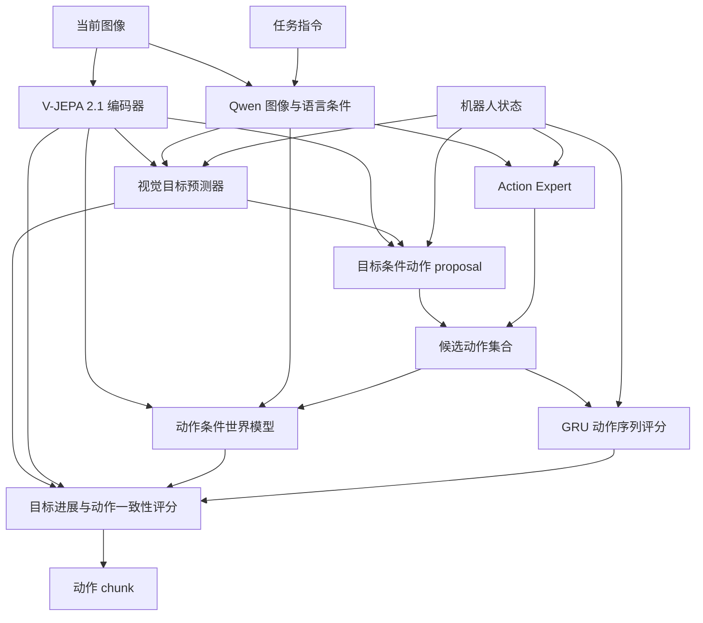

# JEPA Learned Goal

基于潜在视觉目标的视觉语言动作框架。模型从当前图像、任务指令和机器人状态预测未来目标，在 JEPA 特征空间评估候选动作的执行结果，输出动作 chunk。

## 方法



**目标预测。** 冻结的 V-JEPA 2.1 提取当前视觉特征，与 Qwen 的图像／指令条件特征及 state 一起输入 MLP，输出未来视觉目标 latent。训练目标从示范未来帧自动构造；部署时由当前输入直接预测。

**动作生成。** 目标条件 proposal 根据当前视觉特征、预测目标和 state 生成一个候选，Action Expert 生成其余候选，默认共 8 个。

**动作验证。** 世界模型预测各个候选对应的未来视觉特征，以接近预测目标的程度衡量任务进展。GRU 根据当前 state 和前序动作预测下一步动作，其误差作为动作序列一致性评分。两项合并后选出动作 chunk。

目标、动作监督和世界模型预测使用相同时间跨度。当前帧与未来目标帧独立编码，目标条件动作训练同时使用真实目标与预测目标。默认视觉特征为 1024 维；state、action 维度与 chunk 长度由控制接口配置决定。

## 安装

```bash
git clone --branch feat/jepa-learned-goal https://github.com/Ju6276/VLA-JEPA-DEV.git
cd VLA-JEPA-DEV
conda create -n VLA_JEPA python=3.10 -y
conda activate VLA_JEPA
pip install -r requirements.txt
pip install flash-attn --no-build-isolation
pip install -e .
```

训练使用 CUDA、BF16 和 DeepSpeed ZeRO-2。基础模型为 Qwen3-VL-2B-Instruct 与 V-JEPA 2.1 ViT-L 384px，V-JEPA 权重文件为 `vjepa2_1_vitl_dist_vitG_384.pt`。

```bash
export QWEN_MODEL=Qwen/Qwen3-VL-2B-Instruct
export VJEPA21_CKPT=/path/to/vjepa2_1_vitl_dist_vitG_384.pt
export OUTPUT_ROOT=/path/to/checkpoints
export NUM_PROCESSES=8
export WANDB_MODE=offline
```

`QWEN_MODEL` 支持 Hugging Face 模型 ID 或本地模型目录，`VJEPA21_CKPT` 指向 `.pt` 文件。

## 数据与控制接口

数据使用 LeRobot 格式，包含 `data/`、`videos/`、`meta/info.json` 和 `meta/modality.json`。每个训练样本包含当前观测、任务指令、state、动作 chunk 及对应的未来图像。

| 配置 | SIMPLE | SONIC |
|---|---|---|
| 观测 | 单 ego RGB + 指令 | 单 ego RGB + 指令 |
| state | 32 维 | 46 维 |
| 每步 action | 36 维关节目标与运动控制 | 64 维 motion token + 14 维双手控制 |
| chunk 长度 | 30 | 40 |
| 未来目标时刻 | t+30 | t+40 |
| 默认每卡 batch | 32 | 4 |

SIMPLE 数据可以从 `USC-PSI-Lab/psi-data` 下载：

```bash
export DATA_ROOT=/path/to/sim_data_root
hf download USC-PSI-Lab/psi-data \
  simple/G1WholebodyLocomotionPickBetweenTablesTeleop-v0.zip \
  --repo-type dataset --local-dir /path/to/downloads
mkdir -p "${DATA_ROOT}/dataset"
unzip /path/to/downloads/simple/G1WholebodyLocomotionPickBetweenTablesTeleop-v0.zip \
  -d "${DATA_ROOT}/dataset"
```

SONIC 使用 `Tang-keke/merged_dataset_001` 格式，将数据放在 `${DATA_ROOT}/merged_dataset_001/`。两套接口使用各自的数据统计和 checkpoint。详细字段顺序与归一化规则见 [控制接口](docs/control_interfaces.md)。

## 训练

SIMPLE：

```bash
DATA_ROOT=/path/to/sim_data_root bash scripts/train_g1_delta_jepa_8xa100.sh
```

SONIC：

```bash
DATA_ROOT=/path/to/sonic_data_root bash scripts/train_sonic_learned_goal.sh
```

调整计算资源或训练参数：

```bash
NUM_PROCESSES=4 PER_DEVICE_BATCH_SIZE=2 \
DATA_ROOT=/path/to/sonic_data_root \
  bash scripts/train_sonic_learned_goal.sh \
    --trainer.max_train_steps 40000 \
    --trainer.save_interval 5000
```

默认 run_id 分别为 `g1_pick_between_tables_delta_jepa_8xa100` 和 `sonic_latent_learned_goal`。每个 run 保存配置、`dataset_statistics.json`、`summary.jsonl` 和 `checkpoints/`。

训练包含动作学习、未来特征预测、位移预测、逆动力学、动作先验、目标条件动作重建和目标预测七项损失。网络结构、损失权重与 checkpoint 初始化见 [方法说明](docs/learned_goals.md)。

## 部署

```bash
python -m deployment.model_server.server_policy \
  --ckpt_path /path/to/checkpoints/sonic_latent_learned_goal/checkpoints/steps_40000_pytorch_model.pt \
  --cuda 0 --use_bf16 --port 10093
```

客户端发送当前 ego RGB、任务指令和归一化 state。服务返回 `normalized_actions`，客户端按对应统计量反归一化后执行。

默认自动目标预测与 verifier 开启，`subgoals_path: null`，响应中的 `goal_source` 为 `predicted`。服务加载一份 V-JEPA 编码器和动作条件世界模型；配置中的基础模型路径应在部署机器上可访问。

请求字段、响应格式和客户端示例见 [部署协议](deployment/model_server/README.md)。

## 测试

```bash
pip install pytest
OMP_NUM_THREADS=1 NO_ALBUMENTATIONS_UPDATE=1 \
  python -m pytest tests/test_learned_goal.py -q
```

测试覆盖训练梯度、未来信息隔离、目标预测与覆盖、候选评分、BF16 输出、权重恢复，以及两套控制接口的维度和时间对齐。

## 致谢

基于 [VLA-JEPA](https://github.com/ginwind/VLA-JEPA) 与 [starVLA](https://github.com/starVLA/starVLA)，使用 [Qwen3-VL](https://huggingface.co/Qwen/Qwen3-VL-2B-Instruct) 和 [V-JEPA](https://github.com/facebookresearch/vjepa2) 模型。
