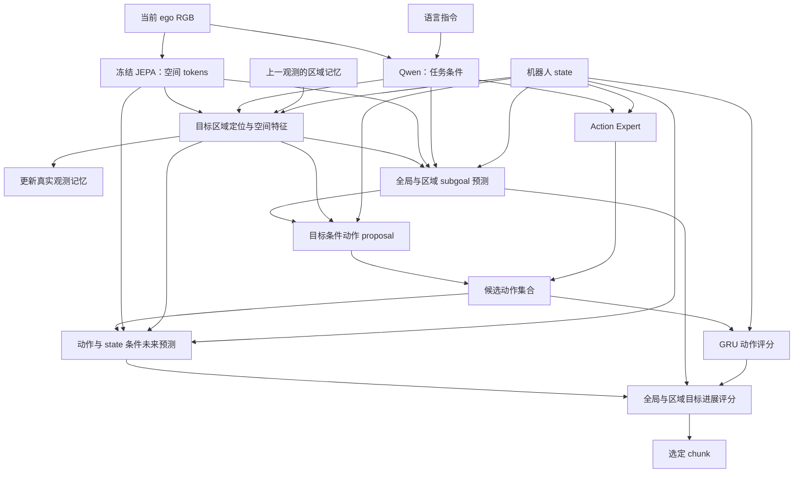

# 目标区域潜在预测与动作选择

> **归档状态：早期设计草稿。** 本文记录需要区域 mask、目标 ID 与可见性监督的显式区域方案，未接入当前训练和部署。当前分支采用无需区域标注的 8×8 spatial latent goal 与真实观测历史，生产实现和配置以 [`docs/spatial_goals.md`](spatial_goals.md) 为准。下文的“当前架构”描述的是该草稿形成时的代码状态，仅用于保留设计演进记录。

本文件定义在 JEPA Learned Goal 上增加目标区域建模的架构。下述区域定位、区域记忆和区域预测接口是待实现的设计；现有代码已经提供全局目标预测、目标条件动作 proposal、动作条件视觉预测和 GRU 动作评分。

研究任务是语言条件的人形机器人移动操作：在单个 ego RGB 相机和机器人本体状态条件下，保持任务目标在视角变化中的对应，预测其短期未来状态，并选择动作 chunk。底层运动控制由 SIMPLE 或 SONIC 执行。

## 1. 当前架构与保留部分

| 部分 | 当前实现 | 新架构中的用途 |
|---|---|---|
| 视觉编码 | `vjepa21_encoder.py`，冻结 V-JEPA 2.1，输出 patch tokens | 保留，分离 JEPA 与 Qwen 的图像预处理 |
| 任务条件 | Qwen 图像／指令条件 tokens | 保留，为区域定位和目标预测提供语义条件 |
| 全局目标 | `LatentGoalPredictor`，MLP 输出归一化全局 latent | 保留为全局目标分支 |
| 动作解码 | `GoalConditionedActionProposal`，MLP＋时间嵌入输出完整 chunk | 增加区域条件投影，保留全局条件和 state |
| 动作采样 | Flow-matching Action Expert | 保留，提供其余候选 |
| 世界模型 | `VisionTransformerPredictorAC`，预测终点 patch tokens | 作为扩展增加显式 state 条件和区域终点输出 |
| 动作先验 | `ActionDynamicsPrior`，GRU 下一步动作误差 | 保留为统计一致性评分 |
| 逆动力学 | `LatentInverseDynamics`，位移 latent＋state 到单步动作 | 保留为训练辅助项 |

当前 SIMPLE 使用 state32/action36/H30；SONIC 使用 state46/action78/H40。接口各自使用归一化统计和控制头。视觉及区域模块采用相同接口，但跨控制接口加载权重仍需显式选择模块。

当前 learned-goal 路径使用当前图像重复组成视频，训练目标是独立编码的 t+H 图像；没有真实观测历史、区域定位或任务阶段划分。

现有世界预测器不直接接收state，GRU动作prior与动作策略接收state。给世界预测器增加state属于新的模型条件设计，应与原有prior配置分别比较。原有成功实验的数据终止策略、padding与checkpoint配置应保留可复现版本。

V-JEPA 2.1 预训练权重用于视觉编码器。当前动作条件世界预测器由仓库代码新建，随机器人示范训练；新增区域模块可以训练独立的小型 heads，无需重新预训练整个 V-JEPA 2.1 编码器。

## 2. 统一的数据流



每次真实观测只更新一次区域记忆。所有候选共享当前区域身份、目标和评分权重；想象出的候选未来不得写回真实观测记忆。

## 3. 表示与模块接口

### 3.1 EncodedObservation

统一编码入口产生以下对象，训练与推理复用同一个入口：

```text
patch_tokens       [B, P, D]       当前时间块的空间 tokens
global_latent      [B, D]          当前 tokens 的归一化池化结果
task_tokens        [B, L, Dq]      当前图像与指令的条件特征
state              [B, S]          对应控制接口的归一化本体状态
patch_xy           [P, 2]          JEPA 图像坐标系中的 patch 中心
image_transform                   原始图像到 JEPA 坐标的映射
timestamp / episode_id / stream_id
```

`global_latent` 从完整当前观测编码中的最后时间块计算一次。预测器内部为组织上下文而截断 tokens 时，不得重新定义“当前状态”。

JEPA 保留独立的 384px 输入支路；Qwen 可沿用其输入处理。区域标签、位置和可视化必须应用 JEPA 支路的同一 resize/crop 映射。避免先统一缩到 224px 后再放大给 JEPA。

### 3.2 TargetRegionEncoder

```text
输入：patch_tokens、patch_xy、task_tokens、state、可选 memory
输出：RegionState

RegionState:
    heatmap        [B, P]          任务区域的软 mask
    local_tokens   [B, K, D]       保留空间排列的局部描述
    box_xyxy       [B, 4]          当前 JEPA 图像中的归一化位置
    visibility     [B, 1]          目标是否可见
    identity_query [B, d]          跨时刻保持目标对应的查询
```

起始实现可以使用任务条件 query 与 patch tokens 的 cross-attention，再用每个 patch 的输出预测 mask。局部描述采用可微 ROI sampling，初始 K=16，对应区域中的 4×4 网格。区域尺度、位置、全局特征和 state 一起传给下游，保留机器人走近目标时的位置和尺度变化。

区域允许指向物体、物体部分或可放置空间。单个区域有邻域范围，不需要将手、物体和放置点分别定义为固定语义槽。多实例场景用目标身份监督区分外观相似的目标。

### 3.3 RegionMemory

```text
update(observation, previous_memory) -> region_state, next_memory
reset(stream_id, episode_id)
```

起始设计为小型 attention 记忆：上一观测的 identity query 和局部 tokens 查询当前 patch tokens，结合新指令条件与时间差定位当前区域。记忆仅包含已观测内容。

训练增加过去／当前帧对，使用仿真目标身份和可见性监督区域对应。目标身份一致不等于状态特征始终相同：杯子被拿起等任务变化需要保留，不能对所有相邻帧强制局部 latent 相等。

服务按 stream/episode 隔离记忆，指令改变、episode 重置或时间间隔超过配置阈值时清空。第一帧与缺少历史的输入仍支持从图像和指令初始化区域。

### 3.4 RegionGoalPredictor

```text
predict_goal(observation, region_state, horizon) -> GoalBundle

GoalBundle:
    global_goal    [B, D]
    region_goal    [B, K, D]
    target_query   [B, d]
    horizon_steps  [B]
    horizon_seconds[B]
```

用少量 Transformer decoder queries 读取当前空间特征、任务条件、state 和区域记忆，预测固定 H 后的局部 JEPA 特征。全局分支可继续使用现有 MLP。

第一版保持现有 H30/H40，暂不加入自适应阶段分割。时间跨度按各自数据 fps 换算为秒，不将两套控制接口的步数直接视为相同物理时间。

训练的区域目标由未来图像与未来区域标签构造：未来图像独立经过冻结 JEPA，再按标签区域采样 K 个局部 tokens。目标特征使用 stop-gradient，首版采用固定采样方式，避免目标与预测同时通过可训练投影改变而产生退化。

未来图像和未来区域标签只用于监督；不进入当前 observation、在线定位器或真实记忆。

### 3.5 GoalConditionedActionProposal

```text
propose(observation, region_state, goal_bundle) -> [B, H, A]
```

在现有全局 proposal 上加入区域条件 adapter，将局部 tokens、区域位置和预测区域 goal 投影到动作上下文。保留 `[z_current, z_goal, z_goal-z_current, state]` 的全局支路。

动作 proposal 仍学习示范 chunk。真实 goal 与预测 goal 混合训练，初期沿用 predicted goal 的 stop-gradient。Action Expert 继续提供其他候选；不必在第一版同时重写整个动作专家。

### 3.6 StateConditionedRegionDynamics

```text
predict_future(observation, region_state, candidate_actions) -> FuturePrediction

FuturePrediction:
    global_future  [B, D]
    region_future  [B, K, D]
    region_box     [B, 4]
    visibility     [B, 1]
```

复用已有世界预测器，增加机器人 state 的投影条件，并用绑定当前目标身份的 region query 提取／预测未来局部描述。训练时预测区域和动作依赖必须来自当前输入与候选动作，不能用未来区域标签作为推理必需条件。

未来区域位置由候选动作条件决定；候选之间共享的是目标身份，而非相同像素坐标。真实未来区域标签监督对应关系，避免候选改变相机视角后比较到背景或另一个物体。

`VisionTransformerPredictorAC` 当前按固定条件 token 数构造 attention mask。加入 state 或 region tokens 时，应同步按真实 token 布局构造 mask 和位置编码，禁止只拼接 tokens 而沿用旧 mask。

### 3.7 LatentVerifier

```text
score = w_global * global_progress
      + w_region * region_progress
      - w_prior  * action_prior_error
```

区域距离在保持目标身份且空间排列一致的局部表示间计算。区域权重由当前观测与共享目标的可信度确定，一次候选评价过程中固定。候选自身预测低可见性不能直接把自己的误差降为零；不可比较的候选需明确标记，采用配置的回退或不可见性代价。

区域外观匹配需要全局上下文、区域位置和 state 补充，以区分相机走近与物体被实际操作。首版提供二维区域信息，不将其解释为已标定的三维距离或接触可行性。

SONIC 的 prior 可配置为 motion token 与双手两组误差，分别求均值后加权，避免仅由维度数量决定64维身体token与14维手部的相对权重。两组权重属于评分配置，不能解释为物理稳定性概率。

## 4. 训练数据契约

| 字段 | 用途 | 部署是否需要外部提供 |
|---|---|---|
| current RGB、instruction、state | 当前观测与动作条件 | 是，沿用现有客户端 |
| timestamp、episode/stream ID | 时间对齐与记忆隔离 | 需要；可由客户端传递或连接会话生成 |
| past observations | 跨帧区域对应训练 | 在线由历史观测缓存形成 |
| action chunk、action_valid_mask | 动作与 prior 监督 | 否 |
| future RGB、goal_valid、effective horizon | 未来目标监督 | 否 |
| current/future region、target ID、visibility | 定位、对应和区域未来监督 | 否，作为训练标签 |
| image transforms | 图像与区域坐标的一致映射 | 由预处理内部维护 |

仿真环境可以新导出区域与目标身份标签；现有下载数据不应被假定已经包含这些字段。真实示范可采用离线定位伪标签并抽样校正。标签生成器不进入部署依赖。

新增固定时域目标分支可先使用满足 `t + H < episode_length` 的完整样本，保证未来目标真实存在。若保留尾段，需明确有效动作 mask、有效目标跨度和终止动作定义。过滤尾段属于数据策略变更，不应覆盖原有实验配置。

## 5. 损失与梯度

保留动作学习、全局未来预测、goal prediction、proposal 和 prior 损失；新增：

- 区域定位损失：mask BCE/Dice 或已标注区域上的位置损失。
- 区域对应损失：跨帧身份匹配与可见性监督，按有效区域计算。
- 区域目标损失：预测 subgoal 局部 tokens 对齐独立编码的未来区域目标。
- 区域动力学损失：候选为示范动作时，预测终点区域及其位置、可见性。

初始训练冻结 JEPA 并显式设置 `requires_grad_(False)`，将其排除优化器。监督特征 stop-gradient；区域提取器和未来预测器按各自损失训练。目标选择与预测需有区域监督约束，避免仅通过动作损失学习无法解释的 attention。

首版不增加可学习的候选评分融合网络；先保留可分解的评分，便于判断区域建模改变了哪些候选选择。

## 6. 代码组织与兼容

```text
starVLA/model/modules/world_model/
  delta_jepa.py                 现有全局 heads 与 prior，保留旧 checkpoint 路径
  region_representation.py     EncodedObservation、RegionState、TargetRegionEncoder
  region_memory.py             按真实观测更新的区域记忆
  region_goal.py               GoalBundle、RegionGoalPredictor、区域动作 adapter
  latent_verifier.py           FuturePrediction、可分解候选评分
  vj2_predictor.py             增加显式 state 条件与动态 token 布局

starVLA/model/framework/VLA_JEPA.py
  encode_observation(...)      训练／推理共用的当前观测编码
  build_training_targets(...) 独立未来目标和有效性构造
  predict_goals(...)           同次请求计算一次共享目标
  generate_candidates(...)    proposal 与 Action Expert
  predict_and_score(...)      候选未来与分项评分
```

以上为拟增加的文件与接口。主 framework 负责组织流程，区域模块负责表示和损失；避免继续把区域定位、缓存管理和所有 loss 都堆进一个 `forward`。

新增配置使用 `framework.region_goal.enabled`，默认为 false。旧 checkpoint 保持原类名和参数路径；新模块从旧模型初始化时，明确列出新增参数。恢复完整新 checkpoint 时继续使用严格加载，不用全局 `strict=False` 隐藏缺失权重。

部署默认仍返回归一化 action chunk。可选诊断输出包含当前区域热图、目标来源、每个候选的全局／区域／prior 分数及选中索引；不默认返回庞大的全部视觉 tokens。

## 7. 实施顺序与验收

1. **先统一基础数据契约。** 统一当前 latent 的时间块、明确尾段终止语义与固定H目标有效性、统一 dtype 与图像转换；为对应故障加入回归检查。训练诊断进入 eval 模式，完整 resume 与权重导出分别实现。
2. **实现当前帧区域表示。** 数据包含区域监督，定位器输出 heatmap、局部 tokens、位置和可见性；确认所有 resize/crop 后图像与标签仍对应。
3. **加入区域 goal 和动作条件。** 未来区域标签只用于目标构造；部署无标签完成区域 goal→action chunk。保留现有全局分支。
4. **加入区域未来预测与评分。** 相同当前输入下改变候选动作可改变预测未来；每个候选评价相同目标身份，分数可独立检查。
5. **加入跨帧记忆。** 缓存由真实历史更新；首次观测、遮挡、重定位、指令切换、episode reset 和多客户端不会混用状态。

必要的正确性检查包括：修改未来图像不改变当前目标预测输入；训练与部署使用同一当前 latent；跨分辨率坐标变换正确；尾段不会成为伪动作标签；BF16 的完整候选路径能导出；候选顺序不改变共享目标或真实记忆；单个相机的历史输入不包含未来帧；两套动作接口的维度、统计和物理时间独立验证。

研究贡献可围绕三个环节组织：自主潜在目标与动作生成、移动视角下的目标区域预测、目标进展与动作一致性的候选选择。新增模块的技术问题是让目标区域贯穿子目标、动作条件和未来评价，并在视角变化中保持对应。
